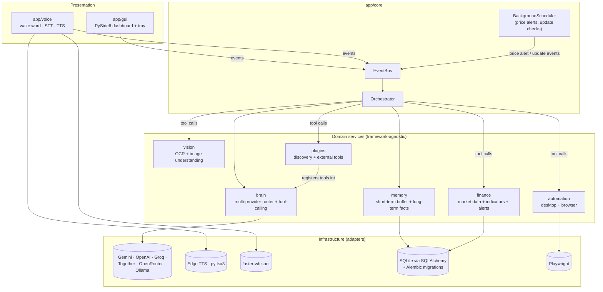

# FRIDAY OS — Architecture (Phase 1)

## 1. Design goals, ranked

When goals conflict, resolve in this order:

1. **Maintainability over years** — a solo dev (or small team) must be able
   to add a Phase-8, Phase-9 feature in 2028 without re-reading the whole
   codebase.
2. **Low idle resource use** — this runs 24/7 in a tray. Idle CPU/RAM
   matters more than raw throughput.
3. **Swappable AI/voice vendors** — providers change pricing, get
   deprecated, or go down. No domain code should hard-depend on one SDK.
4. **Safety** — destructive actions (delete files, run unattended browser
   form submissions) require explicit confirmation, always.

## 2. Layered architecture

```
┌─────────────────────────────────────────────────────────┐
│  PRESENTATION                                            │
│  app/gui (PySide6 dashboard, tray)                        │
│  app/voice (mic in / speaker out)                         │
└───────────────────────┬─────────────────────────────────┘
                         │ events
┌───────────────────────▼─────────────────────────────────┐
│  APPLICATION / ORCHESTRATION                              │
│  app/core: EventBus, Orchestrator, Scheduler, Config       │
│  — routes intents to the right domain service or plugin    │
└───────────────────────┬─────────────────────────────────┘
                         │ interfaces (ports)
┌───────────────────────▼─────────────────────────────────┐
│  DOMAIN SERVICES (framework-agnostic business logic)       │
│  brain · memory · automation · finance · vision ·          │
│  research · productivity · monitoring · plugins            │
└───────────────────────┬─────────────────────────────────┘
                         │ adapters (implementations)
┌───────────────────────▼─────────────────────────────────┐
│  INFRASTRUCTURE                                            │
│  Gemini/OpenAI/Groq/Ollama SDKs · edge-tts/Piper ·          │
│  faster-whisper/Vosk · Playwright · pywin32 · SQLAlchemy    │
└─────────────────────────────────────────────────────────┘
```

**Rule:** arrows only point downward. `app/brain` (domain) defines an
`LLMProvider` interface; `app/brain/providers/gemini_provider.py`
(infrastructure-adjacent adapter) implements it. The orchestrator never
imports `google.generativeai` directly — only the adapter does. This is
what makes "add OpenRouter support" a one-file change instead of a
refactor.

The same layering, as a diagram GitHub renders natively (Mermaid) rather
than relying on monospace alignment surviving every viewer:




## 3. The event-driven core

Everything funnels through one event bus so voice, GUI clicks, and
scheduled jobs all use the same command path — there's exactly one
"brain" to route intents, not three copies of similar logic.

Example flow — user says "Friday, what's my CPU usage?":

```
mic → wake_word detects "friday" → WAKE_WORD_DETECTED event
    → orchestrator switches to conversation mode
    → stt transcribes "what's my CPU usage" → TRANSCRIPT_READY event
    → intent router: this matches monitoring domain, not brain/LLM
    → monitoring service queries psutil → RESPONSE_READY event
    → tts speaks it + gui shows a toast
```

Example flow — user types "summarize this PDF" in the GUI:

```
gui → COMMAND_SUBMITTED event (skips voice entirely)
    → orchestrator: intent = research.summarize_pdf
    → research service extracts text, calls brain (LLM) for summary
    → RESPONSE_READY event → gui renders it (no TTS needed, GUI-only turn)
```

Same orchestrator, same event types, two different entry points. This is
the payoff of building the event bus first.

## 4. Multi-provider AI brain (Phase 3 preview)

```python
class LLMProvider(Protocol):
    async def complete(self, messages: list[Message], **kwargs) -> LLMResponse: ...

class ProviderRouter:
    """Tries providers in priority order (config/settings.yaml:
    brain.provider_priority), falls over to the next on failure/timeout."""
```

Gemini, Groq, Together, OpenRouter, and OpenAI all speak OpenAI-compatible
or near-compatible APIs, so most adapters are thin. Ollama is the offline
fallback when no network/API key is available.

## 5. Memory model (Phase 3 preview)

Two tiers, matching how the spec describes it:

- **Short-term (conversation memory):** last N turns, kept in-process,
  passed directly into the LLM context window.
- **Long-term (semantic memory):** projects, habits, folders, preferences,
  goals — embedded and stored in a local vector store (Chroma), retrieved
  by similarity when relevant to the current query, not dumped in wholesale.

Both are backed by SQLite as the source of truth; the vector store is a
derived index that can be rebuilt from SQLite if it ever gets corrupted.

## 6. Plugin architecture (Phase 6 preview)

```python
class BasePlugin(ABC):
    name: str
    version: str

    @abstractmethod
    def register(self, orchestrator: Orchestrator) -> None:
        """Subscribe to events / register intents this plugin handles."""

    @abstractmethod
    def commands(self) -> list[CommandSpec]:
        """Declares what this plugin can do, for the GUI plugin manager
        and for intent routing."""
```

Built-in capabilities (finance, vision, etc.) implement this exact same
interface — no special-casing. `app/plugins/registry.py` discovers plugins
by scanning `app/plugins/builtin/` plus a user `plugins/` directory (added
in Phase 6) without any core code changes needed to add a new one.

## 7. Why these specific technology choices

| Concern | Choice | Why not the alternative |
|---|---|---|
| GUI | PySide6 (Qt) | CustomTkinter can't cleanly do the charting/animation/tray/threading combo this spec needs at production polish |
| Browser automation | Playwright | Async-native (matches our core), auto-waiting reduces flakiness vs Selenium |
| Local STT | faster-whisper (primary), Vosk (lightweight fallback) | faster-whisper is CTranslate2-based — much lower latency/CPU than vanilla Whisper |
| TTS | edge-tts (primary, free, natural), pyttsx3 (offline fallback) | ElevenLabs/Piper stay optional — best quality but added cost/setup |
| DB | SQLite + SQLAlchemy 2.0 + Alembic | Same ORM code works against Postgres later; Alembic gives real migrations instead of hand-written ALTER TABLEs |
| Config | pydantic-settings + YAML + .env | Type-validated, and non-secret behavior (settings.yaml) is git-committable while secrets (.env) never are |
| Async core | asyncio + qasync bridge | Voice/LLM/browser are I/O-bound; qasync lets asyncio and Qt's event loop coexist in one process |
| Packaging | PyInstaller + Inno Setup | Standard, well-documented path to a Windows .exe + installer (Phase 7) |

## 8. Folder structure

```
friday_os/
├── app/
│   ├── main.py                 # entry point
│   ├── core/                   # orchestrator, event bus, scheduler, config
│   ├── voice/                  # wake_word/, stt/, tts/          (Phase 2)
│   ├── brain/                  # providers/, memory/, router     (Phase 3)
│   ├── automation/             # desktop/, browser/                (Phase 3)
│   ├── finance/                # providers/, indicators/         (Phase 4)
│   ├── vision/                                                   (Phase 5)
│   ├── coding/                 # git/GitHub tools, project templates
│   ├── research/
│   ├── productivity/           # notes, reminders
│   ├── plugins/                # base.py, registry.py, builtin/  (Phase 6)
│   │                             (system monitoring lives here, as a plugin)
│   ├── gui/                    # main_window, tray, pages, components
│   ├── data/                   # SQLAlchemy models + repositories
│   └── utils/                  # logger.py, security.py
├── tests/{unit,integration}/
├── scripts/                    # setup / dev scripts
├── installer/                  # PyInstaller + Inno Setup config (Phase 7)
├── docs/architecture/          # this file + diagrams
├── config/
│   └── settings.yaml           # non-secret config (git-committed)
├── data/{db,vector_store,user_files}/   # gitignored runtime data
├── logs/                       # gitignored
├── .env.example                # template — copy to .env, never commit .env
├── .gitignore
├── pyproject.toml
├── requirements.txt
└── README.md
```

## 9. Phase roadmap

| Phase | Deliverable | Status |
|---|---|---|
| 1 | Architecture, folder structure, config/logging skeleton, runnable tray shell | ✅ Done |
| 2 | Wake word ("Friday" via Porcupine), faster-whisper STT, Edge/pyttsx3 TTS with automatic fallback, silence-detection conversation loop, event-driven orchestrator, PySide6 dashboard with live status + activity log + text input, graceful text-only degradation | ✅ Done |
| 3 | Multi-provider AI brain (Gemini/OpenAI/Groq/Together/OpenRouter/Ollama via one OpenAI-compatible adapter) with automatic fallback and tool-calling; SQLAlchemy + Alembic memory (short-term buffer + long-term categorized facts); desktop automation (files, apps, volume, brightness, power, clipboard, screenshot); Playwright browser automation; a real confirm-before-destructive-action flow | ✅ Done |
| 4 | Financial intelligence: live market data (US/Indian stocks, crypto, forex, commodities via yfinance), technical indicators (RSI/MACD/EMA/SMA/ATR/Bollinger/VWAP/support-resistance/trend via `ta`), candlestick charts (mplfinance), news sentiment (VADER), portfolio tracking with real weighted-avg-cost and live P/L, and a background-scheduled price alert system that speaks a notification the moment a target is crossed | ✅ Done |
| 5 | Vision: Tesseract OCR (images + PDF pages, with automatic OCR fallback for scanned/image-only PDF pages), embedded PDF image extraction, AI-brain-based image understanding/object recognition via the existing multi-provider vision-capable models (no separate CV stack), screen capture + OCR-or-describe analysis | ✅ Done |
| 6 | Plugin system: `BasePlugin` interface, discovery from `app/plugins/builtin/` + external `<project_root>/plugins/`, SQLite-persisted enable/disable state, dashboard Plugins dialog, full error isolation for broken plugins. Three built-in plugins: Weather (Open-Meteo, keyless), System Monitor (CPU/RAM/disk/battery/network + threat warnings), Spotify (OAuth playback control) | ✅ Done |
| 7 | PyInstaller + Inno Setup Windows installer (per-user install, optional startup/desktop shortcuts, data-preserving uninstall); GitHub-releases-based update checker; `--startup` launch mode; full lint/format/type-check pipeline (ruff, black, mypy — all clean across 88 source files); GitHub Actions CI; Mermaid architecture diagram; CONTRIBUTING.md + INSTALLER_GUIDE.md; Settings dialog (voice engine, AI provider priority reordering, start-with-Windows toggle, update check) backed by a proper user-writable settings override layer, separate from the bundled read-only defaults | ✅ Done |
| — | **Coding assistant** (in the original feature list, never assigned to one of the 7 phases above): git operations (init/status/commit/branch), GitHub repo creation, and three project scaffolding templates (python-cli, fastapi, react) — each verified by actually running its generated test suite, not just checking file existence. "Generate/explain/debug code" deliberately has no dedicated tool — it's the AI brain's native ability plus `read_file_content`/`write_file_content`, avoiding a redundant tool for something the brain can already do in conversation. See `docs/architecture/CODING_ASSISTANT_SETUP.md`. | ✅ Done |
| — | **Notes & reminders** (in the original "Productivity" feature list; the `Note`/`Reminder` database models existed since Phase 3 but were never wired into any tool until this pass): `add_note`/`list_notes`, `add_reminder`/`list_reminders`/`complete_reminder`, plus a background-scheduler job (mirroring the existing price-alert pattern exactly) that polls for due reminders and speaks them the moment they're due, with no AI brain involvement — deterministic, same as price alerts and update notifications. Reminder due-times are ISO 8601 datetimes the AI brain computes itself (it already has `get_current_datetime`), not a custom natural-language time parser. | ✅ Done |
| — | **Wikipedia research** (in the original "Research Assistant" feature list; the rest of that list — web search via `browser_search`, document/PDF summarization via the vision tools plus the AI brain's own reasoning — was already covered, this was the one genuinely missing piece): `search_wikipedia` + `get_wikipedia_summary` against Wikipedia's free, keyless REST API, using the same search-then-fetch-by-exact-title pattern as any real Wikipedia user, so the AI brain never has to guess an article's exact title. | ✅ Done |

Each phase ends with runnable, tested code before moving to the next —
no phase depends on unfinished work from a later phase.
